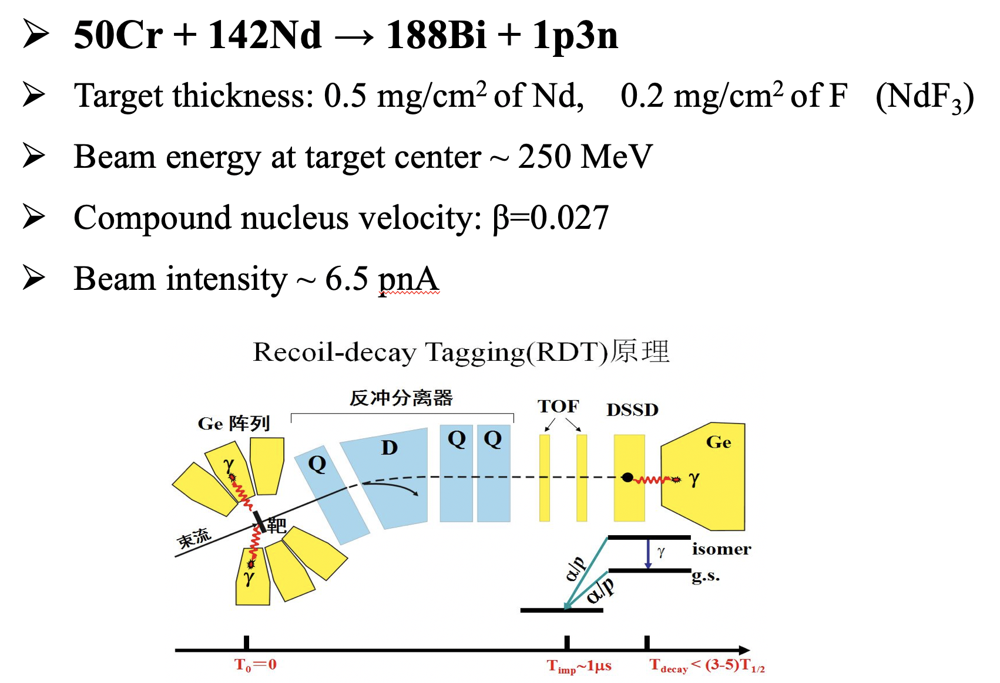
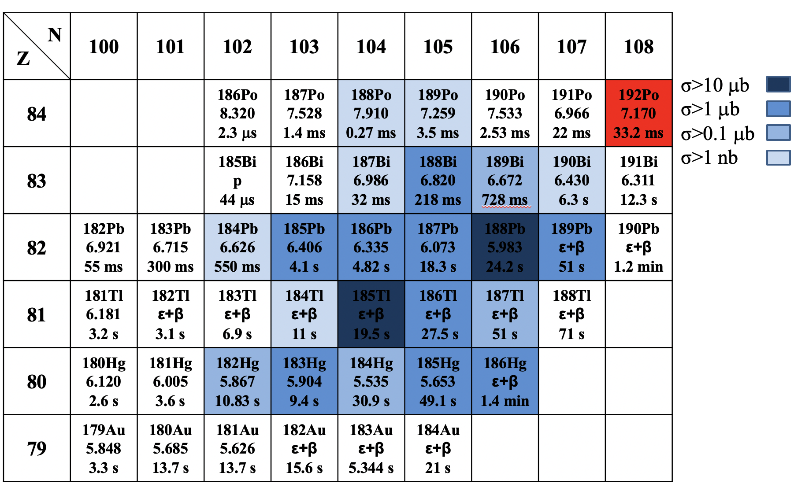

# AGAFA 数据分析代码

## Online代码分析流程

1. GammaSphere, AGAFA, Xarray阵列独立记录各自的数据。
   - 每个获取的具体Trigger方式未知。但从数据结构看，GammaSphere和XA的外部触发可能是由DSSD提供的。每个获取记录外部触发后8μs内各通道的自触发数据。 

2. GEBMerge：按照timestamp的先后顺序，将上述三种阵列数据存到同一个文件中。
 
3. GEBSort：将符合时间窗(8μs)内的不同阵列数据放在一个事件内。
   - 对每种数据进行解码。
   - 进行数据分析，填充histogram等。

## 基于ROOT的offline代码

### [simple_gebsort](https://github.com/wuhongyi/simple_gebsort)：将符合后的数据输出到ROOT文件。代码：Wu Hongyi， Li Jing
 - 在GEBSort程序的基础上，精简了每个探测器的数据结构，将其输出到ROOT文件，供下一级程序分析。
   - 为了简化代码，这一级只输出未进行刻度的原始数据。
 - 编译：root6下
   - rm \*Dict\*
   - make clean
   - make
 - 用法: ./gebsort_local.sh runnumber
   - 在gebsort_local.sh中修改文件路径。
  
  ### [gsort](https://github.com/wuhongyi/gsmfma372)：对探测器进行mapping和刻度。代码：Wu Hongyi
  - 进一步精简数据结构，只输出必要的参数
    - 探测器只保留 e,id,ts等参数
  - 运行方法 ./gsort run_number
    - 在main.cpp中修改输入文件和输出文件路径
    - 在tree.h 中修改beta参数
      - #define Pars_beta 0.0270
  - Tree画图举例
    - opt->Draw("dfma.e:dmfa.id>>(160,0,160,1000,0,100000)","dfma.flag==2","colz");//dssd正面的能量 vs.探测器编号
    - opt->Draw("@dfma.size()",","colz");//dfma的多重性，@dfma.size() 对应于hit数据结构的nhit
    
   
### 用户分析代码：在上述数据的基础上，进一步编写用户分析程序。
-  [analysis-1](https://github.com/zhihuanli/AGAFA-data-analysis/tree/master/dfma) last modified：Aug. 10 
   - 重复数据去除，符合时间窗，x-y 相邻条相加 etc.
### 已知问题
   - DSSD背面的mapping：相邻条的关联关系不正确。
   - GammaSphere的BGO反康：除了id=91的探头，大部分探测器的BGO反康没有正常工作。
   
### Calibration run
- run96 and run100 for DSSD calibration 
- run102 for Gammasphere
- run105 for Sibox
- run106 for Xarray

### Setup

| $E_{\alpha}$ (keV) |      |      |      |      |      |      |      |      |      |      |      |      |
| ------------------ | :--: | ---- | ---- | ---- | ---- | ---- | ---- | ---- | ---- | ---- | ---- | ---- |
| $T_{1/2}$ (Ms)     |      |      |      |      |      |      |      |      |      |      |      |      |
| Origin             |      |      |      |      |      |      |      |      |      |      |      |      |
